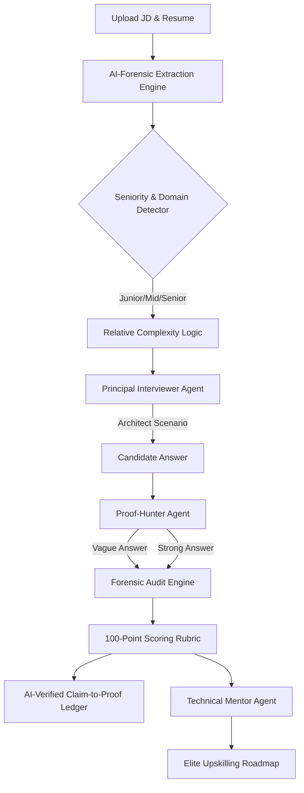

# 🛡️ SkillProof AI: Claim-to-Proof Agent

> A resume tells you what someone claims to know — not how well they actually know it.

**SkillProof AI** is a production-minded talent assessment engine built for the Deccan AI Catalyst 2026 Hackathon. It conversationally assesses real proficiency, identifies gaps, and generates a personalized learning plan focused on adjacent skills.

## 🚀 The "Why" and The Business ROI
We built this agent to solve measurable business problems:
1. **Cost Reduction**: Replaces expensive manual resume screening and 1st-round technical screening.
2. **Accuracy Lift**: Moves away from "vibe-checks" and keyword matching to actual **conversational proof** using Senior Architect level scenarios.
3. **Workflow Throughput**: Automatically generates a Claim-to-Proof Ledger and a concrete Learning Roadmap, enabling hiring managers to make fast, evidence-backed decisions.

## 🏗️ Architecture & Scoring Logic

The system is built on a **Forensic Agentic AI** framework utilizing `gemini-3-pro-preview` acting as a Senior Principal Architect.



### 🧠 The Scoring Logic (100-Point Forensic Rubric)
Instead of a simple rating, SkillProof uses a rigorous **Auditor's Rubric**:
- **Resume Evidence (Max 25):** Are claims mapped to verifiable conversational signals?
- **Answer Quality (Max 45):** Technical accuracy, specific tool mentions, and p99/scale metrics.
- **Practical Depth (Max 20):** Evidence of tradeoffs (Why Tool A vs B?) and failure handling.
- **Confidence (Max 10):** Communication certainty and lack of textbook definitions.

## ✨ Key Features (God-Tier Accuracy)
- **AI-Forensic Extraction**: Bypasses regex to use Gemini 3 Pro for mapping complex technical signals from JDs to Resumes.
- **Relative Difficulty**: Automatically detects seniority (Junior/Mid/Senior) and adjusts scenario depth.
- **Forensic Ledger**: A transparent, AI-audited trail showing which technical claims were "Proven" or "Flagged as Risk".
- **Zero-to-Hero Roadmaps**: Generates production-grade projects (Proof Artifacts) specifically tailored to the gaps exposed in Turn X of the interview.

## 💻 Local Setup Instructions

1. **Clone the repository:**
   ```bash
   git clone https://github.com/Sehaj64/SkillProof-.git
   cd catalyst_agent
   ```

2. **Install requirements:**
   ```bash
   pip install -r requirements.txt
   ```

3. **Set your Gemini API Key:**
   (Required for Gemini-generated interview questions and the AI-personalized learning roadmap.)
   ```bash
   export GEMINI_API_KEY="your_api_key_here"
   ```
   On Streamlit Cloud, add the same key as `GEMINI_API_KEY` or `GOOGLE_API_KEY` in App settings -> Secrets.

4. **Run the App:**
   ```bash
   streamlit run app.py
   ```

## 🎥 Demo Video
[Link to Demo Video] (Add your YouTube/Loom link here)

## 📁 Sample Inputs & Outputs
Included in the `sample-data/` folder:
- `sample-jd.txt`: Senior AI Engineer JD
- `sample-resume.txt`: High-impact candidate resume
- *Outputs are generated dynamically in the UI tabs (Gap Analysis, Learning Plan).*

---
Built with ⚡ for Deccan AI Catalyst 2026.
