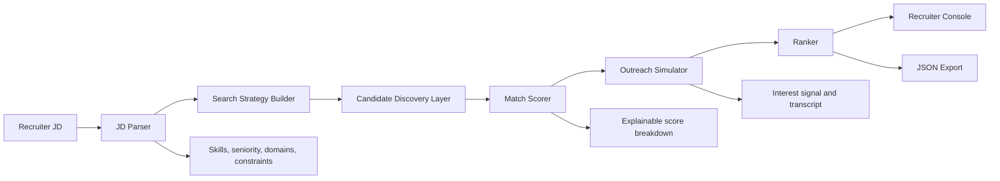

# TalentSignal Agent

AI-powered talent scouting and engagement agent for the Deccan AI Catalyst challenge.

The app takes a job description, parses hiring requirements, discovers matching candidates from a simulated talent market, runs explainable match scoring, simulates conversational outreach, and returns a ranked shortlist with `Match Score`, `Interest Score`, decision labels, transcript snippets, and recruiter next steps.

## Quick Start

```powershell
python -m venv .venv
.\.venv\Scripts\Activate.ps1
pip install -r requirements.txt
python run.py
```

Open `http://127.0.0.1:8000`.

## What It Covers From The Brief

- JD parsing: role, seniority, years, location, remote policy, must-have skills, nice-to-have skills, domains, responsibilities.
- Candidate discovery: simulated public profile, GitHub, portfolio, ATS, and CRM sourcing layer.
- Matching: explainable scoring with exact skills, adjacent skills, seniority fit, domain fit, evidence depth, logistics, and differentiators.
- Conversational outreach: simulated personalized opener, candidate response, follow-up, constraints, reservations, and next action.
- Ranked recruiter output: combined ranking based on match and interest, with evidence, risks, and counterfactuals.
- Documentation: architecture diagram, scoring logic, sample inputs and outputs, and one-page write-up.

## Architecture



## Scoring Logic

`Match Score` is weighted out of 100:

- Skill alignment: 55 points
- Seniority fit: 15 points
- Domain fit: 10 points
- Evidence depth: 12 points
- Logistics fit: 8 points
- Differentiation: 10 points, capped into the final 100

`Interest Score` is simulated from candidate drivers, responsiveness, remote/location fit, perceived role fit, availability, and reservations.

`Combined Score = Match Score * 0.65 + Interest Score * 0.35`

## API

- `GET /` - recruiter console
- `GET /api/sample-jd` - sample job description
- `POST /api/analyze` - run the agent
- `GET /api/health` - service health

Example request:

```json
{
  "job_description": "Role: Senior AI Engineer...",
  "top_k": 8,
  "simulate_outreach": true
}
```

## APIs And Tools Used

This prototype uses only local/free tooling:

- Python
- FastAPI
- Pydantic
- Jinja2
- Uvicorn
- Vanilla HTML/CSS/JS

No paid LLM API keys are required. Production connectors can be added behind the discovery and outreach interfaces.

## Submission Checklist

- Working prototype: run with `python run.py`
- Source code: this repository
- Architecture: see `docs/architecture.md`
- One-page write-up: see `docs/one_page_writeup.md`
- Sample input: see `samples/sample_jd.txt`
- Sample output: generate with the app's Export JSON button or inspect `samples/sample_output.json`
- Demo video script: included in `docs/one_page_writeup.md`

Before final submission, push this repo publicly and share repository access with `hackathon@deccan.ai`.
