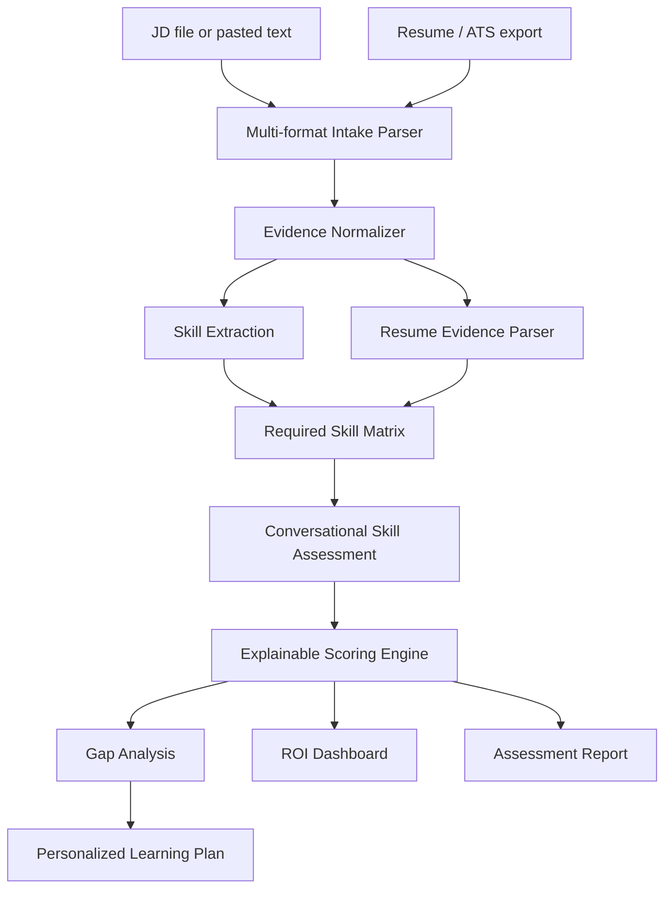

# SkillProof AI

AI-powered skill assessment and personalized learning plan agent for Deccan AI Catalyst 2026.

SkillProof AI takes a **Job Description** and a **candidate resume**, extracts the required skills, runs a conversational assessment for each skill, scores real proficiency, identifies gaps, and generates a personalized learning plan focused on adjacent skills the candidate can realistically acquire.

## Problem

A resume shows what someone claims to know, but not how well they know it. SkillProof AI validates those claims through targeted questions, evidence-based scoring, and gap-focused learning recommendations.

## What The Prototype Does

- Accepts a Job Description and resume.
- Supports pasted text, TXT/MD, PDF, DOCX, CSV, and XLSX uploads.
- Converts spreadsheet/ATS exports into row-and-column labeled evidence text.
- Extracts required skills from the JD.
- Finds resume evidence for each required skill.
- Asks practical assessment questions skill-by-skill.
- Scores proficiency with an explainable rubric.
- Identifies skill gaps and priority levels.
- Explains why each skill was selected and why each gap was detected.
- Adapts the learning plan to the candidate's preferred learning style.
- Builds a personalized learning plan with curated resources, time estimates, and proof tasks.
- Shows ROI estimates for cost saved, accuracy improved, and throughput gains.
- Exports a complete Markdown assessment report.
- Includes an optional AI reviewer layer for semantic calibration notes when an API key is available.

## Architecture



## Scoring Logic

Each required skill is scored out of 100.

```text
total_score =
  resume_evidence_score   up to 25
+ assessment_score        up to 45
+ practical_depth_score   up to 20
+ confidence_score        up to 10
```

| Score | Level | Meaning |
|---|---|---|
| 85-100 | Strong | Job-ready for this skill |
| 70-84 | Ready with checks | Mostly ready, needs light validation |
| 50-69 | Developing | Has foundation, needs targeted learning |
| 0-49 | Gap | Needs foundation work |

## Learning Plan Logic

For every skill below the readiness threshold, SkillProof AI generates:

- gap priority: High, Medium, or Low
- realistic time estimate
- adjacent skills to build from
- curated learning resources
- proof-of-learning task
- learning style adaptation: project-based, video-first, docs-first, or practice drills

Example:

```text
Skill: TypeScript
Timeline: 1-2 weeks
Adjacent strength: React
Plan: Learn interfaces, unions, typed API responses, and build a typed form or dashboard component.
```

## Business Impact

The challenge is about measurable outcomes, not just a chatbot. SkillProof AI maps directly to recruiter and hiring-manager ROI:

- Cost reduction: fewer manual resume claim checks.
- Accuracy lift: every skill is backed by evidence, answers, score components, and reason codes.
- Throughput gain: one structured assessment flow replaces repeated review calls and unstructured notes.
- Auditability: the exported report shows why each gap was detected and how to close it.

The ROI dashboard estimates monthly cost saved, monthly hours saved, throughput gain, and accuracy improvement from evidence coverage, answer coverage, and reason codes.

## Why It Runs Without An API Key

The core assessment engine is deterministic and local. This makes the demo reliable: no rate limits, no hidden API costs, no model downtime, and no hallucinated score changes during judging.

The app still supports optional LLM assistance. In the **Export** tab, an API key can enable an AI reviewer that reads only structured score summaries, reason codes, and learning-plan rows. It does not replace the rubric; it adds semantic calibration notes for the final report.

Optional Streamlit secrets:

```toml
OPENAI_COMPATIBLE_API_KEY = "..."
OPENAI_COMPATIBLE_URL = "https://openrouter.ai/api/v1/chat/completions"
OPENAI_COMPATIBLE_MODEL = "openrouter/auto"
```

This hybrid design is the main differentiator: reliable scoring first, AI review second.

## Local Setup

```bash
git clone <your-repo-url>
cd skillproof-ai-catalyst
pip install -r requirements.txt
streamlit run app.py
```

No API key is required for the demo.

CLI smoke test with sample data:

```bash
python cli.py --sample
```

CLI with your own files:

```bash
python cli.py --jd-file path/to/jd.docx --resume-file path/to/resume.xlsx
```

Run tests:

```bash
python -m unittest discover -s tests
```

## Demo Flow

1. Open the app.
2. Upload a JD/resume as PDF, DOCX, TXT/MD, CSV, or XLSX, or paste both as text.
3. Click **Extract required skills**.
4. Open **Skill Conversation** and show the targeted questions.
5. Open **Gap Analysis** and explain the score breakdown plus "why chosen" / "why gap detected".
6. Open **Learning Plan** and show learning-style preferences, resources, and time estimates.
7. Open **ROI Dashboard** and show cost saved, accuracy improved, and throughput gain.
8. Open **Export** and download the final report.

For a quick demo, use **Run sample end-to-end** in the sidebar's demo helper.

## Sample Inputs And Outputs

- Job Description: `sample-data/sample-jd.txt`
- Candidate Resume: `sample-data/sample-resume.txt`
- Sample Output: `sample-data/sample-output.md`

## Project Structure

```text
skillproof-ai-catalyst/
|-- app.py
|-- cli.py
|-- requirements.txt
|-- skillproof/
|   |-- assessment.py
|   |-- extraction.py
|   |-- file_readers.py
|   |-- models.py
|   |-- report.py
|   |-- sample_data.py
|   `-- taxonomy.py
|-- sample-data/
|-- docs/
`-- tests/
```

## Hackathon Requirement Coverage

| Requirement | Where it is covered |
|---|---|
| Working prototype | `app.py` |
| Deployed URL or local setup | Local setup above and `docs/DEPLOYMENT.md` |
| Source code in public repo | Push this folder to GitHub |
| README | This file |
| 3-5 minute demo video | Use `docs/DEMO_SCRIPT.md` |
| Architecture diagram | Mermaid diagram above and `docs/ARCHITECTURE.md` |
| Scoring / logic | Scoring section above and `skillproof/assessment.py` |
| Sample inputs and outputs | `sample-data/` |

## Differentiators

- Multi-format intake for real hiring workflows: PDF, DOCX, TXT/MD, CSV, and XLSX.
- Explainable scoring instead of a black-box chatbot answer.
- Optional AI reviewer instead of mandatory API dependency.
- ROI dashboard tied to cost, accuracy, and throughput.
- Test coverage for scoring, report generation, and file parsing.

## Limitations

- The current prototype uses deterministic scoring for reliable demos.
- A production version should add benchmark question banks, anti-cheating checks, and calibration against real assessment data.
