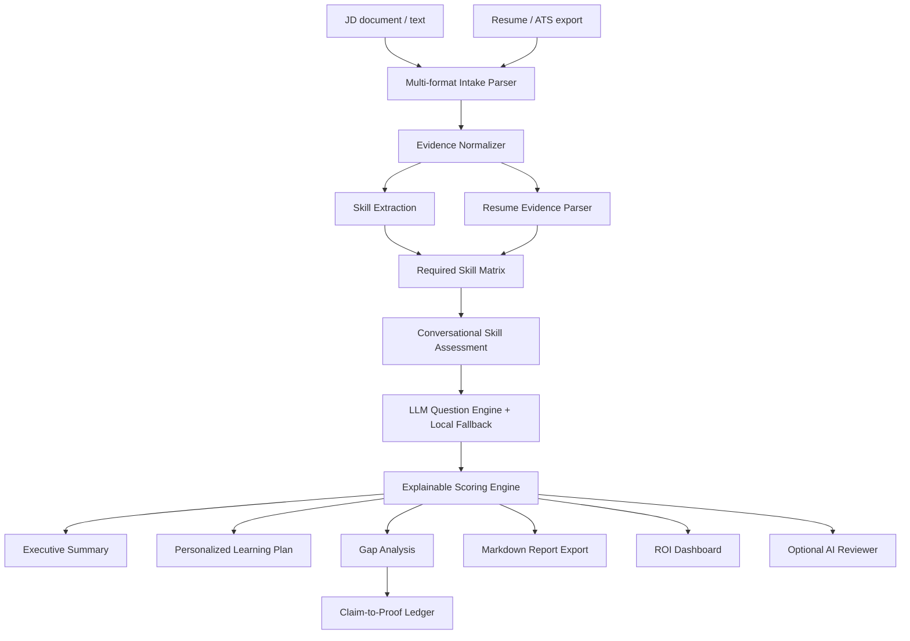

# Architecture

SkillProof AI is built around the challenge requirement: assess real proficiency from a JD and resume, identify gaps, and create a personalized adjacent-skill learning plan.



## Components

### Multi-format Intake

`skillproof/file_readers.py` reads pasted text plus TXT/MD, PDF, DOCX, CSV, and XLSX files. Spreadsheet uploads are flattened into row-and-column labeled text so ATS exports, candidate trackers, and skills matrices can feed the same assessment pipeline.

### Skill Extraction

`skillproof/extraction.py` reads the JD and resume, matches known skill aliases, and creates a skill matrix with:

- skill name
- category
- JD priority
- resume evidence snippets
- assessment questions

The extraction layer has two paths:

- curated taxonomy path for common software, data, AI, testing, API, and communication skills
- dynamic JD fallback for role-specific skills outside the taxonomy, such as SEO, Google Ads, inventory planning, Salesforce, Figma, payroll, Kubernetes, or vendor negotiation

Fallback skills still receive a category, practical questions, resume evidence lookup, adjacent-skill suggestions, resource paths, and proof tasks. This keeps the prototype useful when a judge pastes an unfamiliar JD instead of the sample.

### Conversational Assessment

`skillproof/taxonomy.py` stores skill-specific questions. For dynamic fallback skills, `skillproof/extraction.py` generates proof-based questions from the JD skill phrase. The app presents both as a structured conversation for each required skill.

When a Gemini/OpenRouter/custom API key is configured, `skillproof/ai_assist.py` generates role-specific interview questions and adaptive follow-ups from the JD skill, resume evidence, recent interview turns, and prior answer. If the API key is missing or the model call fails, `skillproof/assessment.py` falls back to deterministic rubric questions and local adaptive follow-ups.

After a candidate enters an answer, the follow-up targets missing proof signals. If the answer lacks a metric, failure case, tradeoff, validation detail, or skill-specific signal, the follow-up asks for that missing evidence. Follow-up answers are included in the score, so the flow behaves like a live assessment rather than a prewritten form.

Questions focus on:

- practical projects
- debugging
- tradeoffs
- edge cases
- measurable outcomes

### Scoring Engine

`skillproof/assessment.py` scores each skill out of 100:

```text
resume evidence: 25
answer quality: 45
practical depth: 20
confidence: 10
```

The scorer also applies calibration checks for generic boilerplate and answer reuse across skills. Reused polished paragraphs are penalized because they do not prove skill-specific proficiency.

### Gap Analysis

`skillproof/report.py` marks each skill as:

- Strong
- Ready with checks
- Developing
- Gap

It also assigns gap priority based on JD criticality and score.

The explainability layer shows:

- why the skill was chosen
- why the gap was detected
- resume evidence score
- answer quality score
- practical depth score
- confidence score
- reason codes

### Executive Summary

The app and exported report start with a judge-facing executive summary:

- readiness decision
- proof coverage
- strongest signals
- main hiring risk
- recommended next action
- business value
- ROI snapshot in the app

This makes the product value clear before a judge studies the detailed tabs.

### Claim-to-Proof Ledger

The ledger is the most judge-facing differentiator. It maps each skill claim to:

- JD priority
- resume proof
- assessment proof
- audit status
- gap reason
- concrete proof task

This directly solves the core problem: a resume claim is not enough until it is attached to evidence, assessment, and a next proof artifact.

### Learning Plan

For weak skills, the system creates a plan with:

- priority
- timeline
- adjacent strengths
- curated course path
- hands-on practice drill
- 5-day sprint plan
- proof artifact
- learning style adaptation

With Gemini/OpenRouter configured, the Learning Plan tab can generate an AI-personalized roadmap from the structured score payload. The roadmap stays evidence-bound and includes target level, adjacent bridge, course path, weekly schedule, practice drill, proof artifact, and retest prompt. The local plan remains available as the auditable fallback.

### ROI Dashboard

The ROI dashboard estimates:

- cost saved
- throughput gain
- time saved
- accuracy improvement from explainable evidence and assessment coverage

These metrics connect the prototype to measurable business outcomes: cost reduction, accuracy lift, and workflow throughput.

### Optional AI Reviewer

`skillproof/ai_assist.py` adds a hybrid AI path. The core score remains local and deterministic, but the Export tab can call Gemini 3 Pro, OpenRouter, or another OpenAI-compatible model to generate calibration notes from structured scores, reason codes, and learning-plan rows.

This makes the app reliable without an API key while still allowing a deployed demo to show LLM-assisted review when a key is configured.

## Why This Is Explainable

Every score is broken down into evidence, answer quality, depth, and confidence. The final report shows reason codes and resume evidence snippets, so the output is auditable instead of a black-box AI summary.
