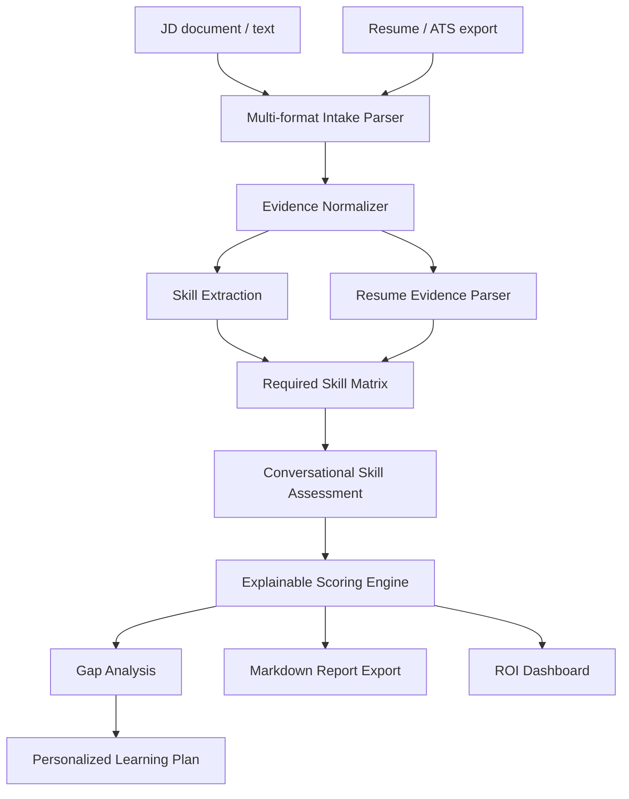

# Architecture

SkillProof AI is built around the challenge requirement: assess real proficiency from a JD and resume, identify gaps, and create a personalized adjacent-skill learning plan.



## Components

### Multi-format Intake

`skillproof/file_readers.py` reads pasted text plus TXT/MD, PDF, DOCX, CSV, and XLSX files. Spreadsheet uploads are flattened into row-and-column labeled text so ATS exports, candidate trackers, and skills matrices can feed the same assessment pipeline.

### Skill Extraction

`skillproof/extraction.py` reads the JD and resume, matches known skill aliases, and creates a skill matrix with:

- skill name
- category
- JD priority
- resume evidence snippets
- assessment questions

### Conversational Assessment

`skillproof/taxonomy.py` stores skill-specific questions. The app presents these as a structured conversation for each required skill.

Questions focus on:

- practical projects
- debugging
- tradeoffs
- edge cases
- measurable outcomes

### Scoring Engine

`skillproof/assessment.py` scores each skill out of 100:

```text
resume evidence: 25
answer quality: 45
practical depth: 20
confidence: 10
```

### Gap Analysis

`skillproof/report.py` marks each skill as:

- Strong
- Ready with checks
- Developing
- Gap

It also assigns gap priority based on JD criticality and score.

The explainability layer shows:

- why the skill was chosen
- why the gap was detected
- resume evidence score
- answer quality score
- practical depth score
- confidence score
- reason codes

### Learning Plan

For weak skills, the system creates a plan with:

- priority
- timeline
- adjacent strengths
- curated resources
- proof task
- learning style adaptation

### ROI Dashboard

The ROI dashboard estimates:

- cost saved
- throughput gain
- time saved
- accuracy improvement from explainable evidence and assessment coverage

These metrics connect the prototype to measurable business outcomes: cost reduction, accuracy lift, and workflow throughput.

## Why This Is Explainable

Every score is broken down into evidence, answer quality, depth, and confidence. The final report shows reason codes and resume evidence snippets, so the output is auditable instead of a black-box AI summary.
