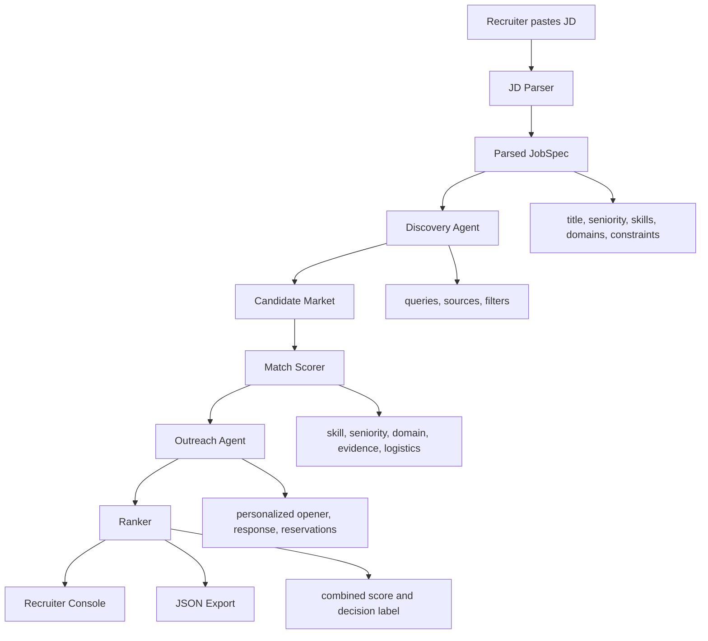

# Architecture

## Components

`app/agent/jd_parser.py`
Extracts structured hiring requirements from a raw job description.

`app/agent/discovery.py`
Builds sourcing queries and retrieves candidates from a simulated market. This is intentionally isolated so real GitHub, ATS, CRM, or consented profile connectors can replace the local dataset.

`app/agent/scorer.py`
Computes explainable `Match Score` with exact and adjacent skills, domain fit, seniority fit, project evidence, logistics, and differentiators.

`app/agent/outreach.py`
Runs simulated candidate engagement. It creates personalized outreach, candidate replies, constraints, reservations, and recruiter next steps.

`app/agent/orchestrator.py`
Coordinates the full run and returns a ranked shortlist.

`app/main.py`
FastAPI service exposing the web console and JSON API.

## Design Choice

The prototype is deterministic and local-first. That makes it reliable for judging, easy to inspect, and safe to run without external credits. In production, an LLM can improve extraction and dialogue generation, but the score pipeline should remain auditable.
